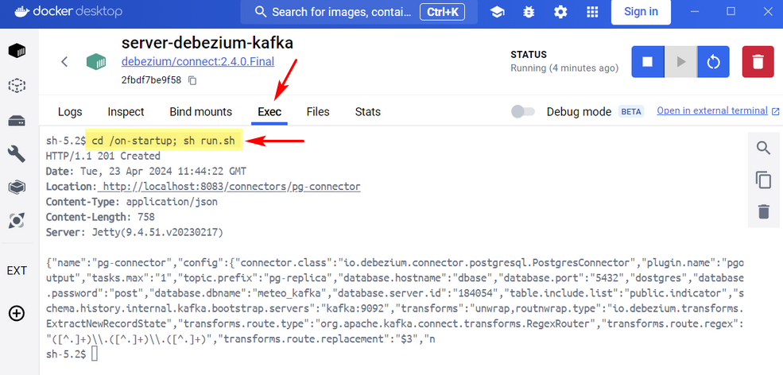

# Server microservice

### <u>Run guide:</u>

#### To build the project:

* .\mvnw clean package
* if not yet...then create\
  docker network create kafka_net --driver bridge

#### To execute the app:

* *docker-compose up -d*
* start Postgres connector for <u>server-debezium-kafka</u> conteiner with command:
```
  cd /on-startup; sh run.sh
```


The Server is running on port 8082

#### Example file <u>.env</u>:

KAFKA_BOOTSTRAP_SERVERS=kafka:9092\
KAFKA_SUBSCRIBED_TOPICS=indicator-temperature,indicator-humidity,indicator-pressure\
KAFKA_BROKER_ID=1\
KAFKA_ZOOKEEPER_CONNECT="zookeeper:2181"\
KAFKA_ADVERTISED_LISTENERS=PLAINTEXT://kafka:9092\
KAFKA_LISTENER_SECURITY_PROTOCOL_MAP=PLAINTEXT:PLAINTEXT,PLAINTEXT_INTERNAL:PLAINTEXT\
KAFKA_OFFSETS_TOPIC_REPLICATION_FACTOR=1\
DEBEZIUM_KAFKA_BROKER_ID=2\
POSTGRES_HOST=dbase:5432\
POSTGRES_DB=meteo_kafka\
POSTGRES_USER=postgres\
POSTGRES_PASSWORD=post\
ZOOKEEPER_CLIENT_PORT=2181\
ZOOKEEPER_TICK_TIME=2000\